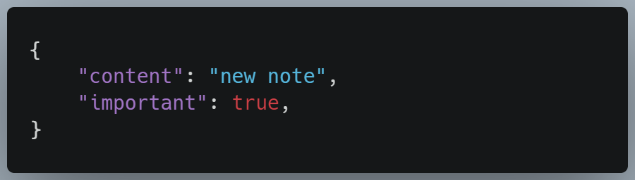
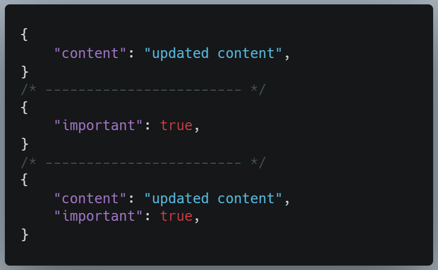
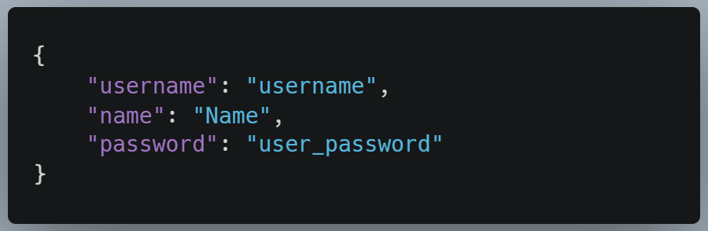
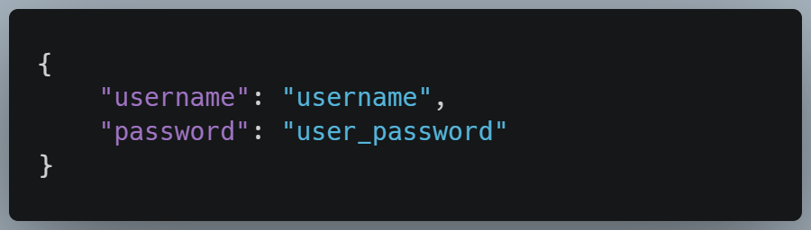

# RESTful Notes API with Authentication

## Stack: NodeJS, MongoDB, Mongoose and JWT

### The API can be tested at my [personal portfolio](https://igga95.github.io/#api-tester-section)

## Notes:

### Examples of requests:

#### GET all:

GET https://vast-escarpment-72140.herokuapp.com/api/notes

#### GET one:

GET https://vast-escarpment-72140.herokuapp.com/api/notes/id

#### POST:

POST https://vast-escarpment-72140.herokuapp.com/api/notes

#### PUT:

PUT https://vast-escarpment-72140.herokuapp.com/api/notes/id

#### DELETE:

DELETE https://vast-escarpment-72140.herokuapp.com/api/notes/id

## Users:

### Examples of requests:

#### GET all:

GET https://vast-escarpment-72140.herokuapp.com/api/users

#### POST:

POST https://vast-escarpment-72140.herokuapp.com/api/users

## Login:

### Examples of requests:

#### POST:

POST https://vast-escarpment-72140.herokuapp.com/api/login

#### Modified code-along proyect of 'Bootcamp Fullstack' by midudev.
